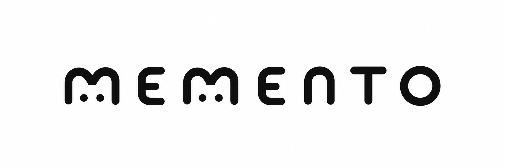

<p align="center">
  
</p>

# Memento RS

> **Persistent memory for AI agents. One binary. Zero external APIs. Zero egress.**

Memento RS is a multitenant memory engine written in Rust for teams running AI agents (Claude Code, Codex, OpenCode, Goose, and custom MCP agents) over a shared knowledge base. It indexes real documents, navigates source code, and gives every agent shared memory with tenant isolation — without the ops tax of Python stacks or the subscription cost of managed vector stores.

**The SQLite of agent memory**: small, embeddable, predictable, standard. Not the Oracle.

---

## Why Memento?

Agents lose context between sessions. Memory scattered across chats, documents, and code doesn't serve them. The alternatives are heavy:

| | Memento RS | Typical Python stack (Mem0/Letta) | Managed vector store |
|---|---|---|---|
| **Deploy** | 1 Rust binary | 5+ services + Postgres | SaaS, egress |
| **RAM** | ~700 MB warm (10k docs) | 2-3 GB+ | N/A |
| **Data** | 100% local | Your infra | Vendor |
| **Code** | Knowledge graph included | No | No |
| **Cost** | $0 licenses | $0, but infra | Per token/MB |

**Validated with real benchmarks** (not aspirational):

- Hybrid search: **p50 10 ms / p99 14 ms** over 132.5k chunks (target: 20/100 ms)
- Code indexing: **100k LOC in 15.4 s**
- Store cold start: **75 ms**
- Steady-state ingest: **14.4 ms/document**
- Spanish-first: multilingual embeddings (E5-Base) with semantic search by default

---

## What it does

### 🧠 Shared memory for agents
Multiple agents on one tenant see the same memory; different workspaces stay isolated. Every result carries full provenance (source, document, agent, model version, timestamp).

### 📄 Real document ingestion
PDF, DOCX, XLSX, Markdown, HTML, and plain text → clean Markdown → deterministic chunking (256-300 tokens, overlap) → embeddings + BM25. Spanish-optimized chunking.

### 🔍 Hybrid search
BM25/FTS + dense embeddings fused with RRF. Literal search is excellent; semantic captures paraphrase and synonyms (even ES↔EN with English corpora).

### 💻 Code knowledge
Indexes Rust/Python repos and builds a real graph: symbols, calls, imports, dependency cycles, architectural summaries. Navigate code like a senior engineer: *"who calls this function?"*, *"what breaks if I change this?"*

### 🔐 Isolation + privacy by design
Tenant context is force-injected — searching without context is a compile-time error. Everything runs local: zero network, zero telemetry, zero tokens.

### 📜 GDPR-ready compliance
Verified right-to-erase (delete → compact → prune), per-tenant export, configurable retention, AES-256-GCM encrypted backups, structured audit. **[Validated end-to-end](docs/validation/gdpr-right-to-erase-e2e.md)**.

### 🔌 Standard agent interface
**MCP stdio server** (15 tools: `memory.*` + `code.*`) + **bilingual CLI**. Any MCP-speaking agent connects in minutes.

---

## Quick start

```bash
# 1. Create a tenant (returns your access token)
memento tenant create --name "my-team"

# 2. Ingest a document
memento ingest document --source 'document:pdf' my_book.pdf

# 3. Search
memento search "how to write magnetic headlines"
```

Connect your favorite agent via MCP:

```json
// .mcp.json (Claude Code, Cursor, etc.)
{
  "mcpServers": {
    "memento": {
      "command": "memento-mcp-server",
      "env": { "MEMENTO_TOKEN": "<token>", "MEMENTO_AGENT_ID": "codex-agent" }
    }
  }
}
```

More: [Installation](docs/install.en.md) · [5-minute tour](docs/quickstart.en.md) · [MCP clients](docs/mcp-clients.en.md)

---

## Project status

**Functional, validated MVP** — 14 validation rounds on real data, all gates PASS:

- ✅ Smoke test + real book ingestion (PDF) + ES semantic search
- ✅ Retrieval benchmark: 10 mixed queries (EN literal / ES paraphrase)
- ✅ Adversarial: cross-tenant, path traversal, malformed PDF, shell metachars, quota
- ✅ MCP server end-to-end (15 tools) + code tools on a real project
- ✅ GDPR right-to-erase + backup/restore + multi-agent same-tenant
- ✅ 339+ tests, clean `clippy -D warnings`

**Next (post-MVP):** external security audit, 2+ week pilots, OCR for scanned PDFs, low-RAM profile (E5-Small opt-in), long-running workers.

## Architecture

Rust workspace of 13 crates, hexagonal: domain → ports → application → thin adapters (MCP/CLI/worker). Storage: embedded LanceDB (vectors + FTS), OKF-RS for code, `anydoc` for documents. Details in [docs/development.en.md](docs/development.en.md).

## Documentation

- [README en español](README.es.md)
- [CLI reference](docs/cli-reference.en.md) · [Configuration](docs/config-reference.en.md) · [Operations](docs/ops.en.md)
- [Security: threat model](docs/security/threat-model.md) · [Audit checklist](docs/security/audit-pre-shipped-checklist.md)
- [Validations](docs/validation/) · [Benchmarks](docs/perf/)

## License

MIT — free for commercial use, no attribution. Built for teams that want full control of their memory.
